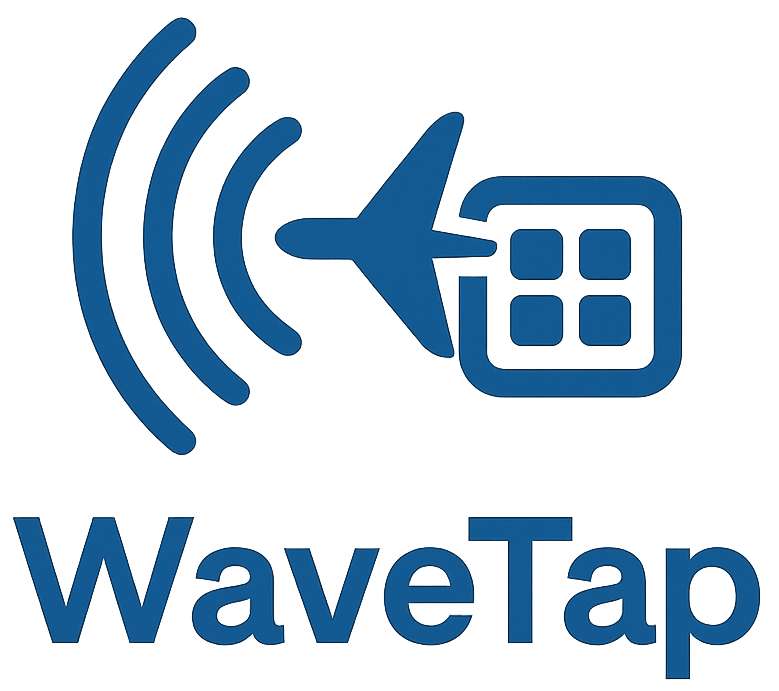

# WaveTap SDR Platform

<p align="center">
  
  <div align="center"><strong><em>SDR Capture, Utilities, and Visualization</em></strong></div>
</p>

WaveTap is a modular software-defined radio (SDR) toolkit built for the SMU CS7319 Software Architecture course. The current implementation focuses on receiving ADS-B traffic from an RTL-SDR, publishing decoded aircraft telemetry over WebSocket, persisting it to SQLite, and surfacing dashboards through a Flask UI. Each major capability is packaged as its own Python module and can be composed together locally or via Docker.

## Highlights

- **End-to-end ADS-B pipeline** – `sdr_cap` ingests dump1090 frames, `database_api` persists telemetry, and the WaveTap UI exposes dashboards and REST endpoints.
- **Production-style topology** – the same Python code can run locally or inside Docker containers using the provided Compose file.
- **Extensible control plane** – an Arbiter service is scaffolded to manage future SDR modules and activation policies.
- **Documented architecture** – Mermaid-based C4, class, and data-flow diagrams live alongside the code and are regenerable with a single script.

## Repository layout

```
├── docker/                    # Container build contexts for each service
│   ├── arbiter/
│   ├── database_api/
│   └── sdr_cap/
├── documentation/             # Diagrams, examples, and project collateral
│   ├── diagrams/              # Mermaid sources and rendered PNGs
│   └── diagrams_overview.md   # Guide to the architecture views
├── src/
│   ├── arbiter/               # Flask control plane and module registry
│   ├── database_api/          # Flask UI, ADS-B blueprint, subscriber, DB worker
│   ├── gui/                   # Desktop dashboard prototypes and mapping tools
│   ├── sdr_cap/               # ADS-B publisher and capture helpers
│   ├── utilities/             # Shared logging and spectrum analysis utilities
│   └── main.py                # Local bootstrap that spins up the stack
├── tests/                     # Pytest suites covering publisher, subscriber, arbiter, and GUI glue
├── tools/                     # One-off utilities (e.g., ADS-B helpers)
├── docker-compose.yml         # Orchestrates the microservices for development
├── requirements.txt           # Python dependencies
├── pyproject.toml / pytest.ini
├── dev-env/                   # Environment bootstrap scripts
└── README.md, LICENSE, TODO.md
```

## Architecture at a glance

- **System & container views** – see `documentation/diagrams/img_output/01_c4_system_context.png` and `02_c4_container.png` for the high-level topology.
- **Components & classes** – `03_c4_components.png` and `class_domain.png` drill into the Python modules and relationships actually implemented.
- **Runtime flow** – `flow_data.png` documents the real data path from the RTL-SDR through dump1090, the publisher/subscriber pipeline, SQLite, and the Flask UI.

The diagrams are regenerated from the Mermaid sources using `bash documentation/generate_diagrams.sh`. Additional details live in `documentation/diagrams_overview.md`.

## Local development

### Prerequisites

- Python 3.12
- RTL-SDR dongle (optional for development; required for live RF capture)
- dump1090 or rtl_tcp instance exposing raw Mode-S frames (defaults configurable)

### Environment setup

```bash
cd /path/to/CS7319_Project_WaveTap
bash dev-env/init_env.sh   # creates .venv and installs requirements
source .venv/bin/activate
```

The helper script installs the dependencies defined in `requirements.txt`, including Flask, websockets, pyModeS, pytest, and linting tooling.

### Running the services locally

| Service | Command | Notes |
| --- | --- | --- |
| ADS-B publisher | `python -m sdr_cap.adsb_publisher` | Reads from dump1090 (`DUMP1090_HOST`, `DUMP1090_RAW_PORT`) and serves WebSocket JSON on `ADSB_WS_PORT` (default 8443). |
| ADS-B subscriber | `python -m database_api.adsb_subscriber --uri ws://localhost:8443 --db ./data/adsb_data.db` | Mirrors the publisher stream and persists telemetry via the background `DBWorker`. |
| WaveTap API | `flask --app database_api.wavetap_api:app run --host 0.0.0.0 --port 5000` | Provides dashboards (`/`) and ADS-B REST endpoints under `/adsb`. Set `ADSB_DB_PATH` if you store the database outside `database_api/`. |
| All-in-one bootstrap | `python src/main.py` | Spins up the publisher, subscriber, and API together for rapid iteration. |

Key environment variables:

- `DUMP1090_HOST`, `DUMP1090_RAW_PORT` – where to reach your dump1090/rtl_tcp feed
- `ADSB_WS_PORT` / `ADSB_WS_URI` – WebSocket endpoint published/consumed by the pipeline
- `ADSB_DB_PATH` – path to the SQLite database (defaults to `database_api/adsb_data.db`)
- `ADSB_PUBLISH_INTERVAL`, `ADSB_SAVE_INTERVAL` – throttling controls for publisher and subscriber

SQLite files are safe to inspect with any local tool (for example `sqlite3 database_api/adsb_data.db '.tables'`).

### RTL-SDR on WSL (optional)

If you are using WSL, bind the USB dongle with `usbipd` (see `dev-env/attach_rtlsdr_wsl.ps1`) and confirm the device with `rtl_test -t` before launching the publisher.

## Docker-based workflow

The repository includes Dockerfiles for each service and a Compose stack that mirrors the local topology.

```bash
# build and launch every service
docker compose up --build
```

Services and ports:

| Service | Image context | Exposed port | Purpose |
| --- | --- | --- | --- |
| `adsb-publisher` | `docker/sdr_cap/Dockerfile` | 8443 | WebSocket stream of aircraft telemetry |
| `adsb-subscriber` | `docker/database_api/Dockerfile` | — | Persists JSON updates into `/data/adsb_data.db` |
| `database-api` | `docker/database_api/Dockerfile` | 5000 | Flask dashboards and REST endpoints |
| `arbiter` | `docker/arbiter/Dockerfile` | 8000 | Module registration API (future control plane) |

The subscriber and API share the named volume `adsb-data` so both containers can read/write the same SQLite file.

To build an individual image, point `docker build` at the desired Dockerfile. For example, the API image can be built with:

```bash
docker build -t wavetap-api -f docker/database_api/Dockerfile .
```

## Testing

Activate the virtual environment and run the pytest suite:

```bash
pytest
```

Tests cover:

- Flask Arbiter endpoints (`tests/test_arbiter`)
- Database API helpers and persistence glue (`tests/test_database`)
- SDR publisher behaviour (`tests/test_sdr_cap`)
- GUI scaffolding smoke tests (`tests/test_gui`)

## Documentation & diagrams

- `documentation/diagrams/` holds all Mermaid sources (`*.mmd`).
- Regenerate PNGs with `bash documentation/generate_diagrams.sh`. The script auto-detects Puppeteer’s Chromium binary; install one with `npx puppeteer browsers install chrome` if needed.
- `documentation/diagrams_overview.md` describes each view and links to the latest renders in `documentation/diagrams/img_output/`.

## License & acknowledgements

WaveTap is released under the MIT License (see `LICENSE`). Documentation and tooling were assisted with GitHub Copilot; all human-authored code and decisions are tracked in this repository.

---

For open issues, roadmap items, and future enhancements (VHF/FM modules, richer analytics), check `TODO.md`.
