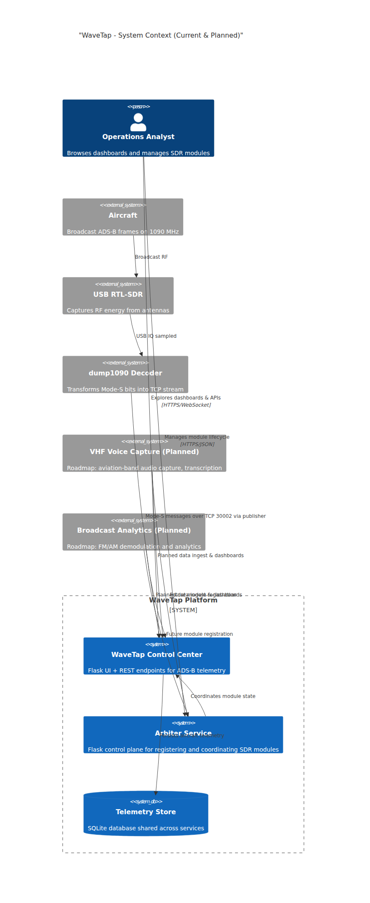
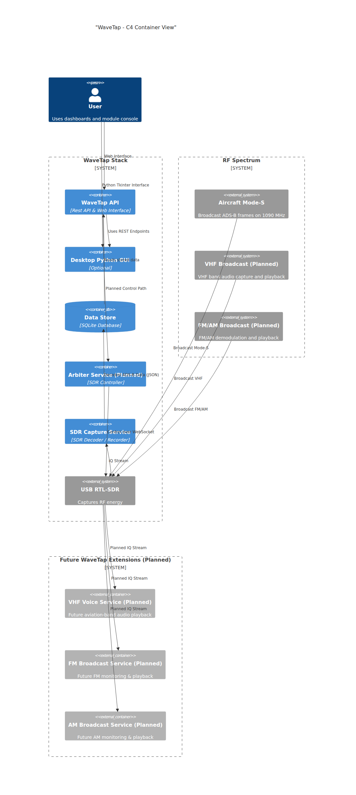
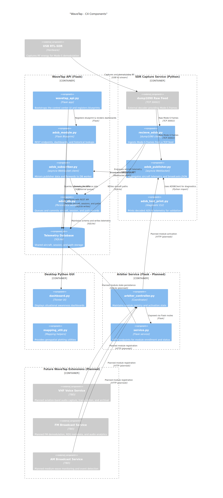
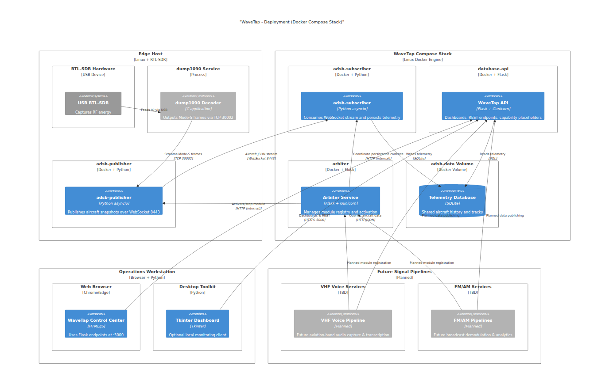
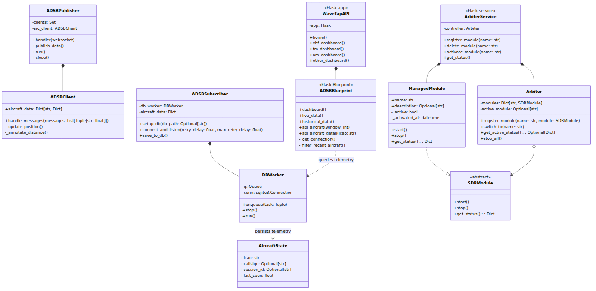
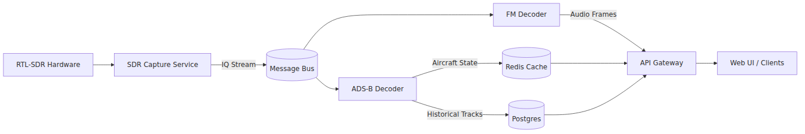
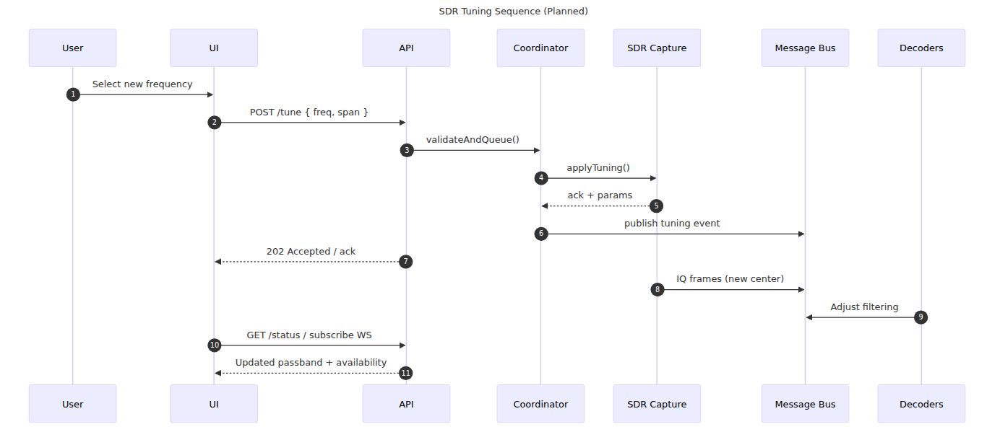
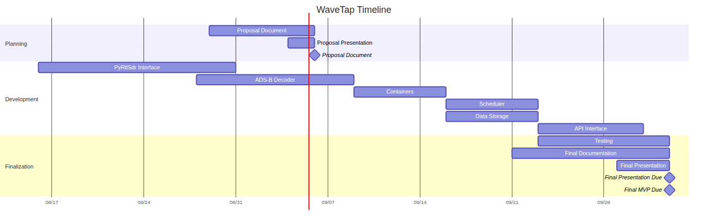

# Diagrams Overview

This document provides an overview of the system architecture diagrams for the 
CS7319 Software Architecture project. Each diagram is presented below with a 
brief description and its corresponding visualization.

---

## 1. System Context Diagram

**Description**: The system context diagram provides an overview of the system's 
boundaries, external systems, and users interacting with it.

---

## 2. Container Diagram

**Description**: The container diagram provides a high-level view of the system,
 showing the major containers (applications, services, and databases) and their interactions.

---

## 3. Component Diagram

**Description**: The component diagram illustrates the internal structure of 
the SDR Capture Service and Coordinator/Arbiter, showing the key components and
their interactions.

---

## 4. Deployment Diagram

**Description**: The deployment diagram shows the physical deployment of the 
system, including the nodes, pods, and containers used in the architecture.

---

## 5. Class Domain Diagram

**Description**: The class diagram represents the domain model, showing the key 
classes and their relationships.

---

## 6. Data Flow Diagram

**Description**: The data flow diagram illustrates the flow of data between the 
system's components, including the SDR, decoders, and storage.

---

## 7. Sequence Diagram

**Description**: The sequence diagram shows the interactions between the user, 
UI, API, and backend components during a typical operation.

---

## 8. Timeline Diagram

**Description**: The timeline diagram provides gantt chart as a chronological 
view of the project's milestones and key events.

---

Each diagram is generated using Mermaid and rendered as PNG files for easy 
visualization.
